# CruiseLink

CruiseLink is an all-in-one management platform designed to streamline the onboard experience of a cruise ship. It provides a seamless connection between passengers and the various service departments, simplifying requests, bookings, and management for everyone involved.

## Live Demo
**Vercel Deployment:** https://cruise-link.vercel.app/  
**GitHub Repository:** https://github.com/J8in-Rao/CruiseLink  

## Table of Contents
- [Overview](#overview)
- [Features](#features)
- [User Roles & Permissions](#user-roles--permissions)
- [Tech Stack](#tech-stack)
- [Architecture](#architecture)
- [Firestore Database Structure](#firestore-database-structure)
- [How to Run Locally](#how-to-run-locally)
- [Project Highlights](#project-highlights)
- [Screenshots](#screenshots)
- [LLD, System Design & Documentation](#lld-system-design--documentation)

---

## Overview
CruiseLink acts as the digital backbone of onboard cruise operations. It eliminates manual walkie-talkie-based coordination and allows voyagers to request any onboard service through a modern web interface.

At the same time, it empowers the staff—Admin, Manager, Supervisor, and Head Cook—to efficiently manage orders, bookings, inventory, analytics, and more.

---

## Features

### Voyager (Passenger)
- Login / signup with room number & stay dates
- Order Catering items (food, snacks, beverages)
- Order Stationery & Gift items
- Book Movie Tickets
- Book Salon Appointments
- Book Fitness Center sessions (with equipment selection)
- Reserve Party Halls (Birthday, Wedding, Get-Together, etc.)
- View **My Orders** & **My Bookings**
- Send messages to Admin via Help Center

---

### Admin (Super User)
- Manage Catering Items (add/edit/delete)
- Manage Stationery Items
- Manage Movie listings & showtimes
- View & manage all Voyagers
- Access the global Voyager Inbox (Help Center)
- View **Overall Analytics Dashboard**
- Generate **AI-Powered Operational Reports** using Genkit

---

### Manager (Booking Overseer)
- View all bookings across Movies, Salon, Fitness, and Party Halls
- Cancel or update any booking
- Manage movie catalog
- Access **Booking Analytics Dashboard**

---

### Supervisor (Gift Shop Manager)
- Manage all Stationery Orders
- Update order status
- Mark inventory in/out of stock
- Access **Stationery Analytics Dashboard**

---

### Head Cook (Catering Manager)
- View all Catering Orders in real-time
- Manage menu inventory (inStock toggle)
- Access **Catering Analytics Dashboard**

---

## Tech Stack

### **Frontend**
- Next.js (App Router)
- React
- Tailwind CSS
- ShadCN UI
- Lucide Icons
- Recharts (Analytics Dashboards)
- react-hook-form + zod (form validation)
- date-fns (date handling)

### **Backend**
- Firebase Authentication
- Firebase Firestore
- Firebase Storage (optional)
- Firestore Rules for RBAC

### **AI Integration**
- Genkit + Google Generative AI  
Used for generating advanced operational analysis (AI-Powered Admin Reports).

---

## Architecture
```
   Next.js (Frontend)
   |
   | Firebase Auth (Email/Password)
   |
   Firestore Database <--- Firestore Security Rules (Role-based)
   |
   | AI Data Query Layer
   |
     Genkit (LLM)
```
     
- Pure serverless architecture  
- Fully role-based Firestore access  
- Modular React components  
- Optimized for scalability & maintainability  

---

## Firestore Database Structure (Short Overview)

### **Primary Collections**

- `allCateringOrders`
- `allStationeryOrders`
- `allResortMovieTickets`
- `allBeautySalonBookings`
- `allFitnessCenterBookings`
- `allPartyHallBookings`
- `cateringItems`
- `stationeryItems`
- `voyagers`
- `messages`
- `role_admin`
- `roles_manager`
- `roles_supervisor`
- `roles_head-cook`

A complete detailed breakdown is available in the *Firestore Database Document*.

---

## How to Run Locally

1.  Clone the repository  
    ```sh
    git clone https://github.com/J8in-Rao/CruiseLink
    cd CruiseLink
    ```

2.  Install dependencies
    ```sh
    npm install
    ```

3.  Add your Firebase config
    - Copy `.env.example` to `.env.local`
    - Insert your Firebase keys

4.  Run the development server
    ```sh
    npm run dev
    ```

5.  Open in browser:
    http://localhost:3000

### Roles and Accounts

For development purposes, you can easily test each permission level.

**Method A: The Sign-Up Page (Recommended)**

1.  Navigate to the **Sign Up** page.
2.  Fill in your name, email, and password.
3.  Select the desired role from the "Role (for development)" dropdown menu.
4.  Complete the sign-up.

**Method B: The Login Page (Automatic Role Assignment)**

The system automatically assigns a role based on the email address you use to sign in:

-   **Admin:** `admin@cruiselink.com`
-   **Manager:** `manager@cruiselink.com`
-   **Supervisor:** `supervisor@cruiselink.com`
-   **Head-Cook:** `head-cook@cruiselink.com`
-   **Voyager:** Any other email address.

The password can be anything, as it will create a new user if one doesn't exist.

---

## Project Highlights

-   Complete role-based access system
-   Real-time Firestore syncing
-   Dedicated dashboards per role
-   Clean modular code with reusable components
-   Extensive analytics with Recharts
-   Fully deployed on Vercel

---

## Screenshots

### Login Page
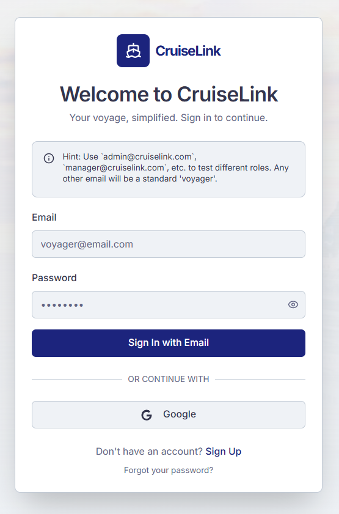

### Voyager Dashboard
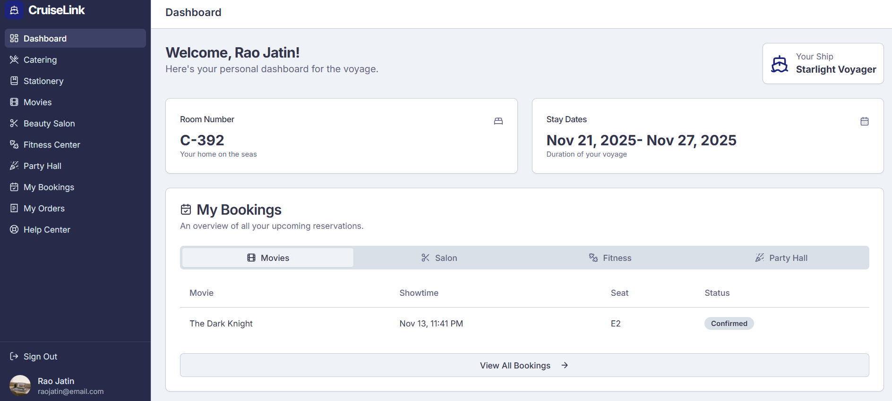

### Catering Items
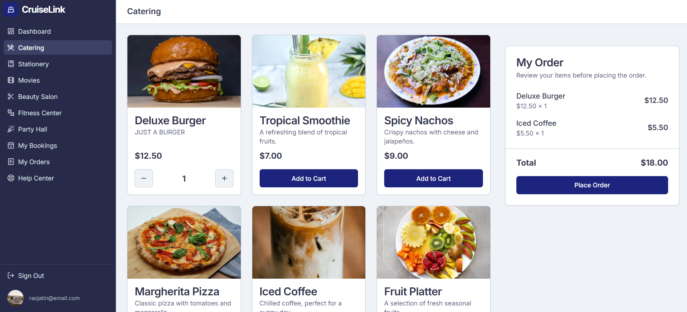

### Stationery Items
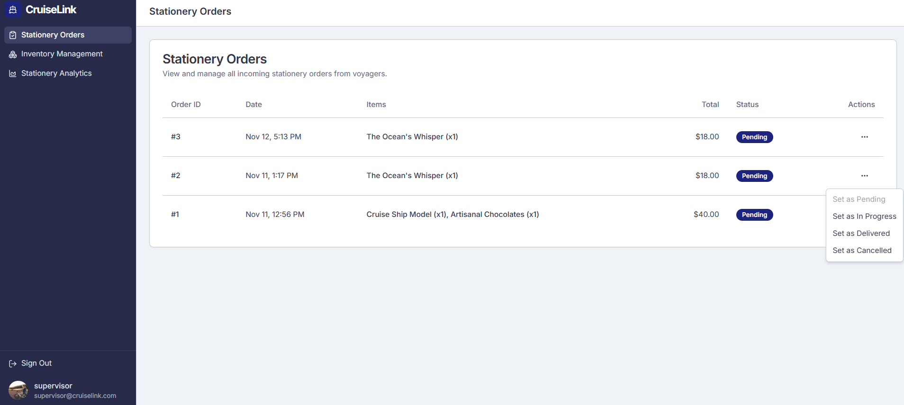

### Movie Booking


### Admin Dashboard
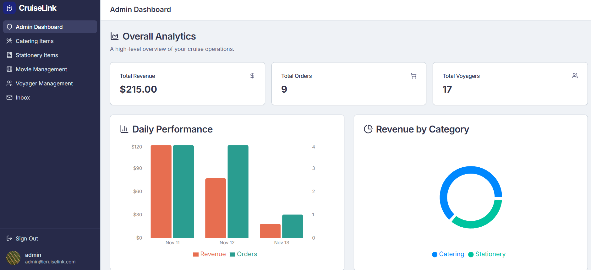

### Manage Items (Admin)
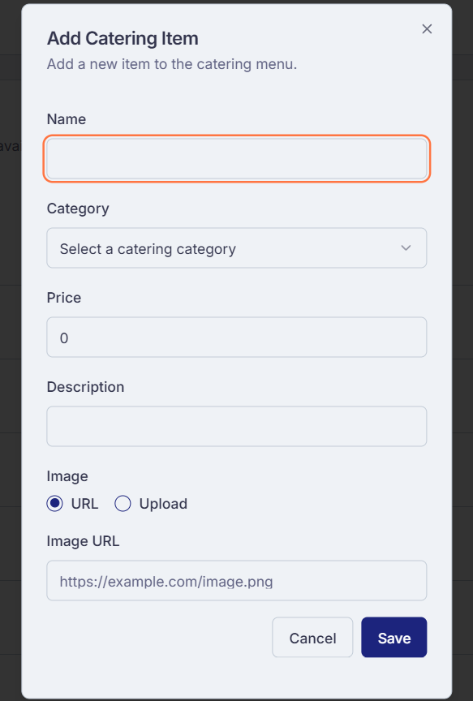
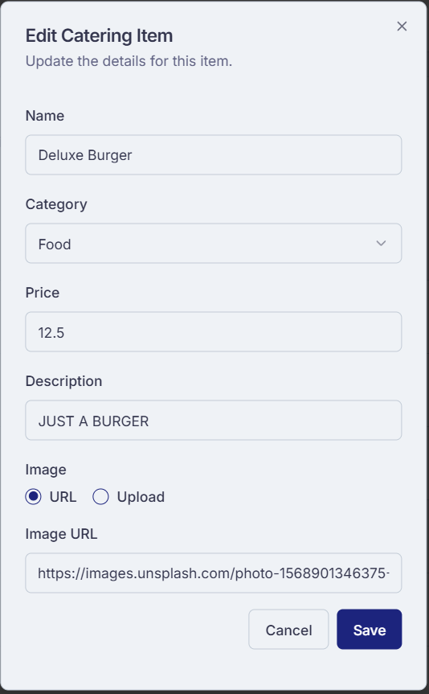

### Stationery Orders (Supervisor)


### Catering Orders (Head Cook)
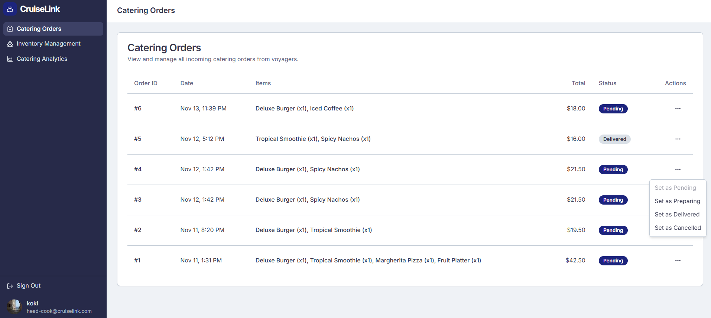

### Manager Bookings Overview
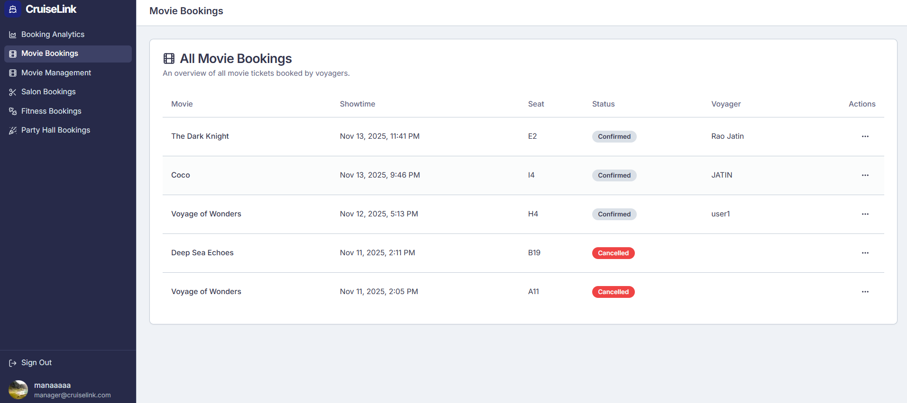

### Reports and analysis
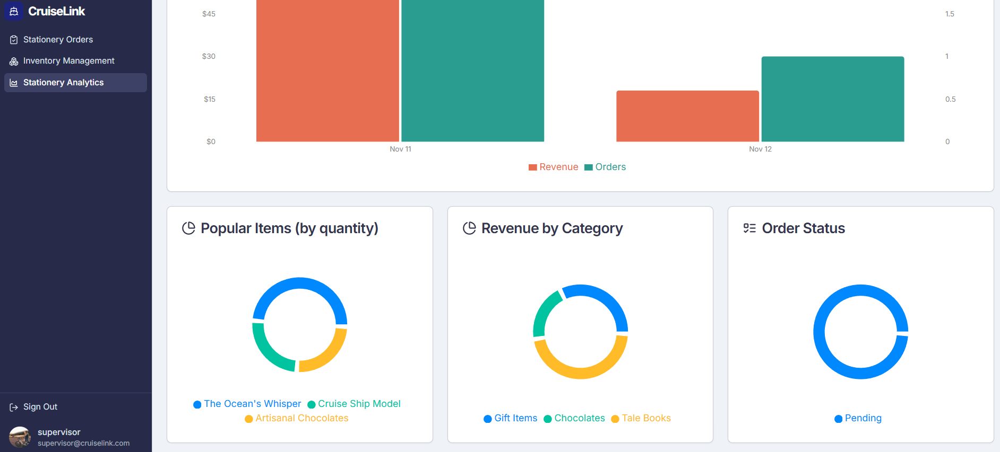
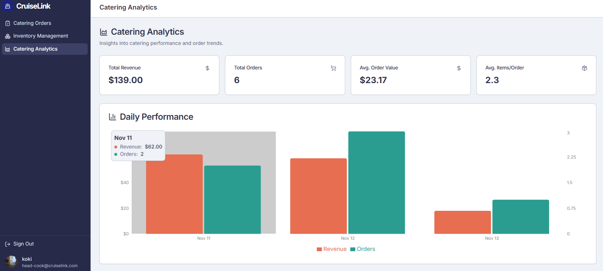


---

## LLD, System Design & Documentation

This repository includes the following essential documents(All are in docs folder):

-   Low-Level Design (LLD)
-   Detailed Project Report
-   Firestore Database Structure Document
-   Test Case Document
-   Security Rules Document
-   Optimization Notes


---

---

## Developer

Jatin Kumar Rao
Built using modern tools & real-world system design principles.
